# ITERATIVE-ASSEMBLIES

This process explores the strategy of assembly by aggregation of parts to make a whole. Inspired by the sculptures of Stephen Ormandy and the joinery of Kawai Tsugite and with the help of computational design, we developed an algorithm for growth and iteration of two components, to generate a design for a pavilion.

During the form exploration, we considered a voxel divided into twenty seven sub-voxels. Each voxel hosts a shape with connection points that vary. We explored growth patterns and aggregation techniques to understand how the system works.

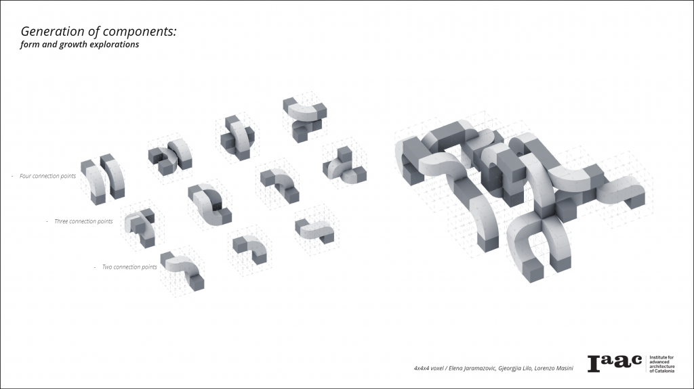

The second part of the analysis was conducted by using a single element that grows in different directions and degrees of rotation.

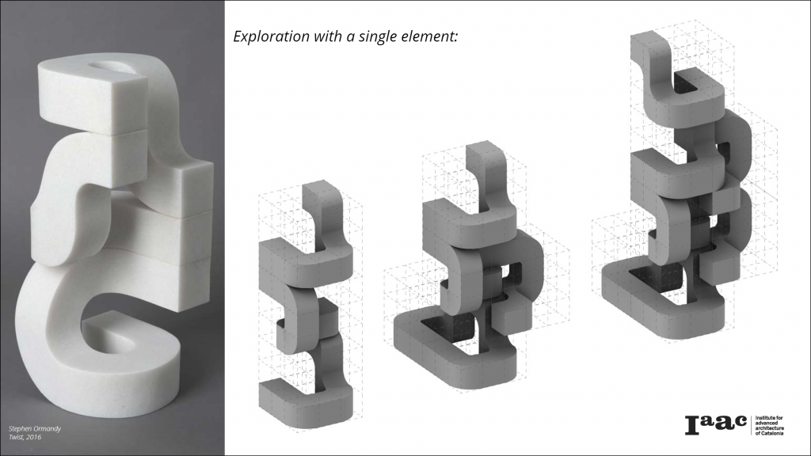

This configuration simplified the aggregation logic by making it possible to streamline the rules for growth.

__Joinery:__

As a further investigation to techniques of assembly, how parts are joined together is a a critical factor for the constructibility of the structure. The focus here was shifted on the detail of the joint. The goal was to integrate the joint into the piece and make the final geometry a continuous system of interconnected elements. Examples of Japanese wood joinery inspired our process.

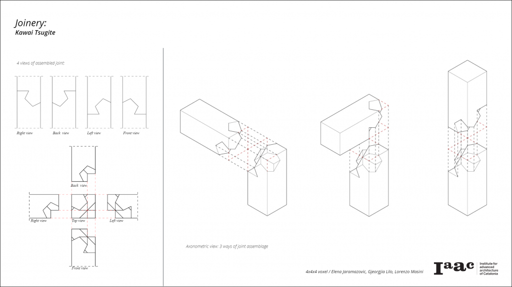

__Components:__

We chose two pieces to develop on the strategy of assemblage to compose our final geometry.

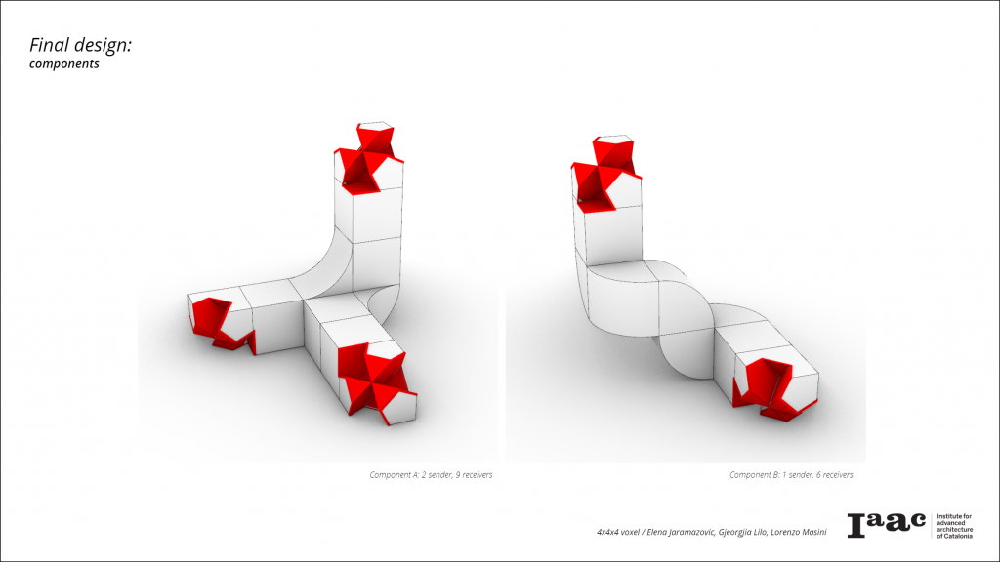

Each component is given a set of senders and receivers: this makes it possible to control the system.

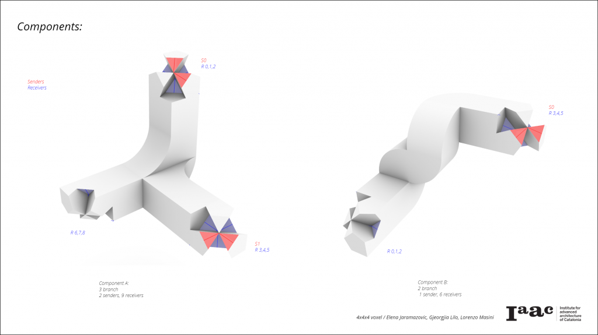

Particular directions of growth created collision within the system and geometry overlap. These issues were identified by examining the possible combinations of senders and receivers.

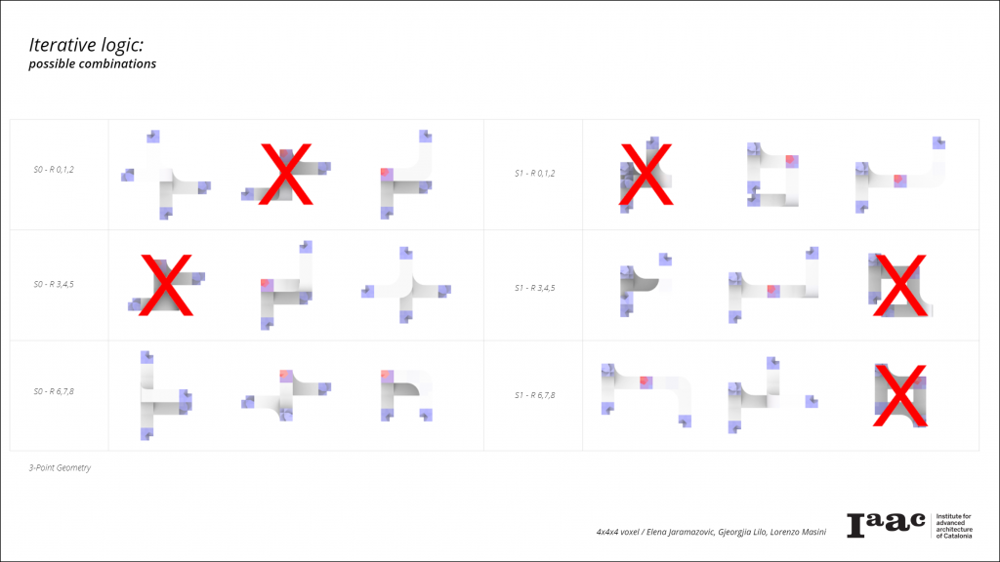
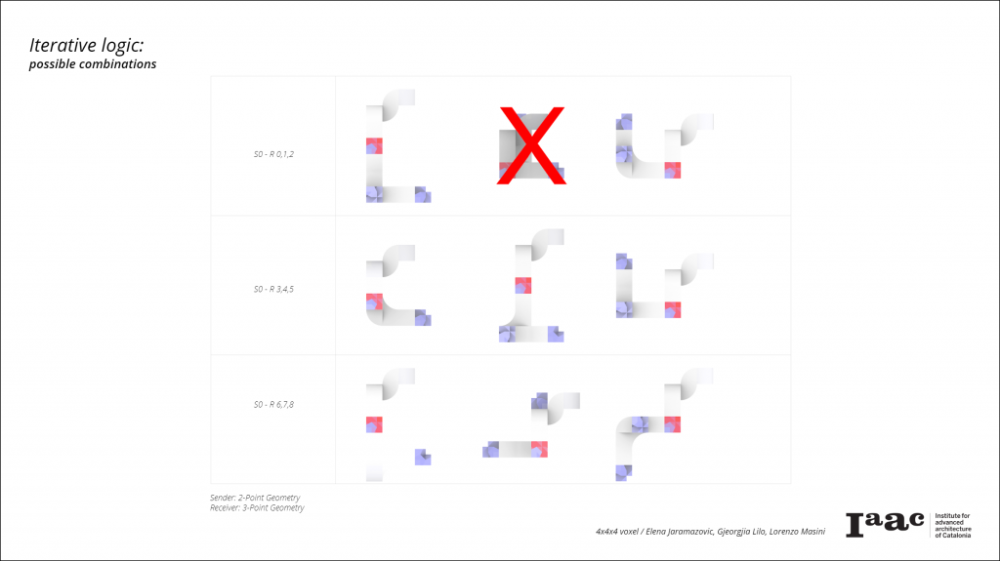

In order to create the pavilion, some additional rules are set in place; the system is directed to fill a volume and grows around a void.

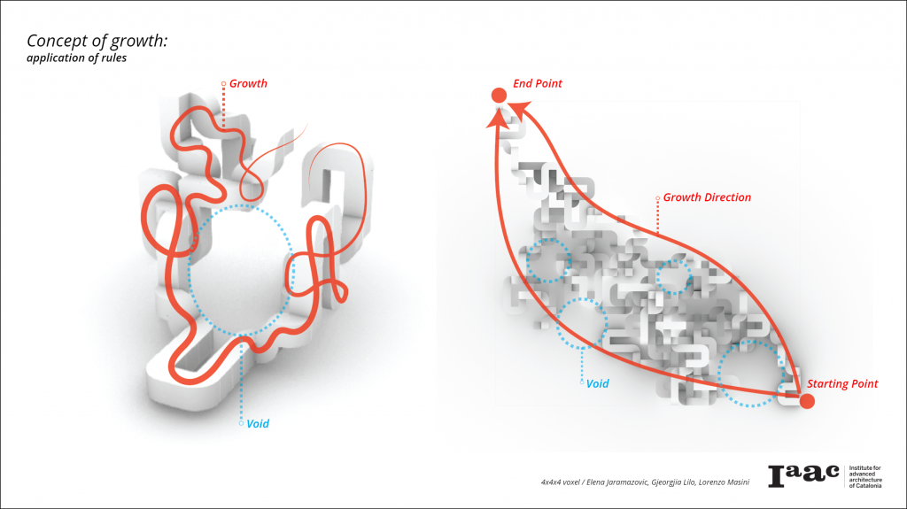

This set of data was included into the grasshopper definition in order to create the iterations by following a specific set of rules. It is possible to control the number of iterations. Once the system is in place, it is possible to explore different iterations and change parameters to get the single desired result.

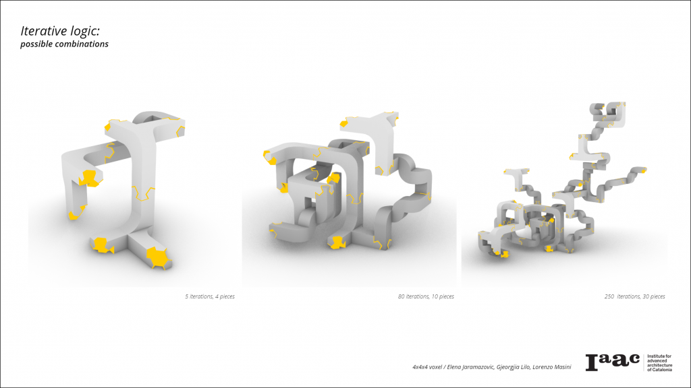
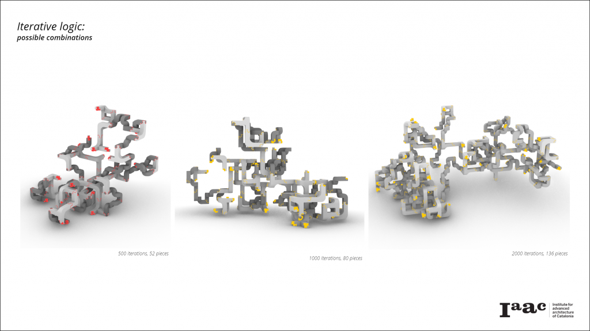
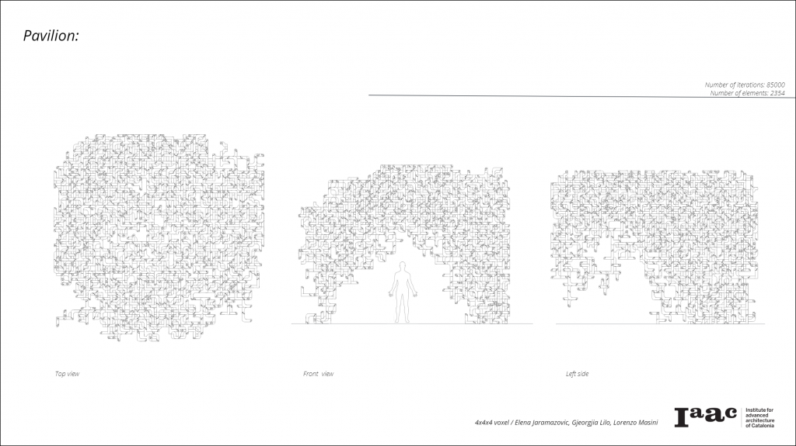
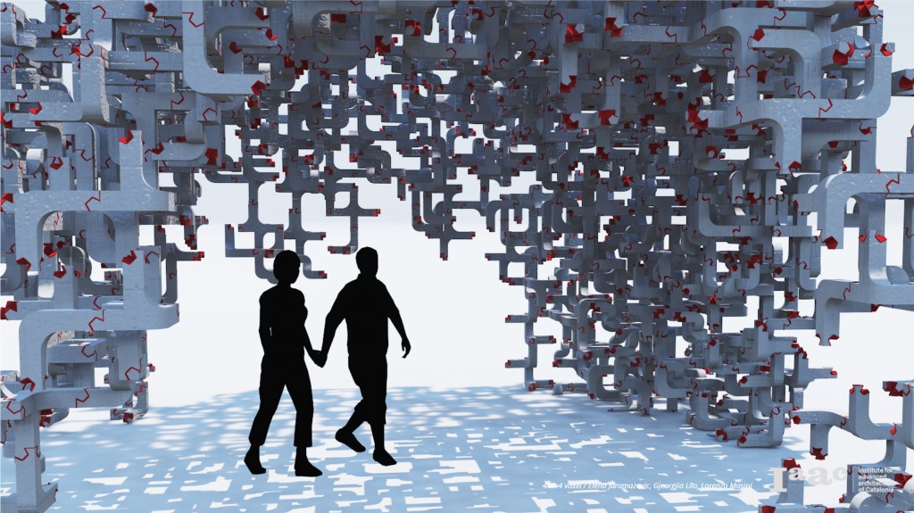

Iterative assemblies is a project of IAAC, Institute for Advanced Architecture of Catalonia developed at Master in Robotics and Advanced Construction in 2019 by:

<dl>
  
__Students:__ 
<dl> 
  
  _Elena Jaramazovic, Gjeorgjia Lilo, Lorenzo Masini_
 </dl>
<dl>
  
__Faculty:__ _Alessio Erioli_

<dl>
  
__Faculty Assistant:__ _Eugenio Bettucchi_
